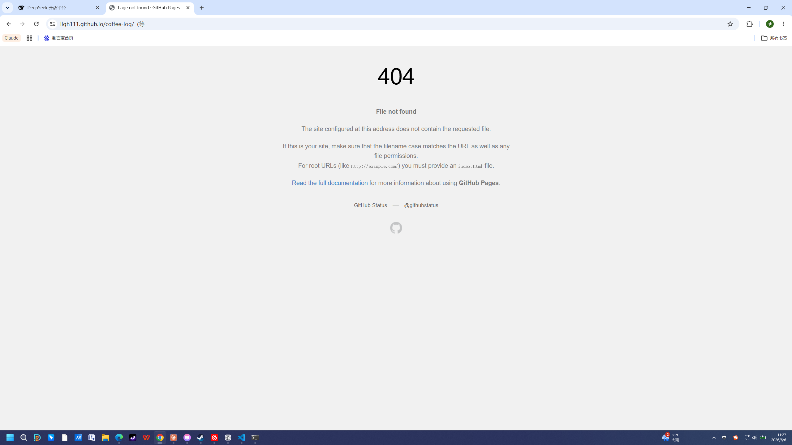

# ☕ 手冲手记 · 咖啡冲煮记录本

> **打开即用，零安装。** 记录每一杯手冲的参数，自动找出你的高分配方规律。

记录每一杯手冲咖啡的变量——咖啡豆、养豆天数、研磨度、水温、粉水比、评分与风味笔记，并自动**找出你的高分配方规律**。

纯前端网页应用：零安装即可用，数据默认存在浏览器本地。支持 **云同步**（自设同步码即可多设备共享）和 **导出/导入备份**。已做成 **PWA**，手机可「添加到主屏幕」像 App 一样使用、并可离线。

## 🌐 在线使用

👉 **https://llqh111.github.io/coffee-log/**

手机浏览器打开上面的网址即可使用。想像 App 一样用：
- **安卓 Chrome**：菜单 → 「添加到主屏幕 / 安装应用」
- **iPhone Safari**：分享按钮 → 「添加到主屏幕」

## 功能

- **咖啡豆**：名称、烘焙商、烘焙日期（自动算养豆天数）、产地/处理法/烘焙度、克数/价格、余量进度
- **冲煮记录**：粉量/水量（自动算粉水比）、研磨度、水温、闷蒸、总时间、器具、1–10 评分、风味笔记
- **味道诊断**：勾选「发酸/发苦/寡淡/太浓/涩」→ 实时给出下次调整方向
- **单豆详情**：最佳配方（一键复现）、调试轨迹（按时间线展示参数变化）
- **评分分析**：高分配方共性、「下次试试」建议、按器具/处理法分组比平均分
- **云同步**：自设同步码，多设备数据自动合并（墓碑机制防复活）
- **PWA**：手机可添加到主屏幕，断网也能用

## 隐私

所有记录默认保存在你浏览器的 localStorage。如启用云同步，数据会通过你自设的同步码加密传输到 Cloudflare KV 存储——只有知道同步码的人能访问。

## 技术

原生 HTML + CSS + JavaScript，无框架、无构建步骤。`index.html` / `style.css` / `app.js` + `merge.js`（合并算法）/ `sync.js`（云同步客户端）+ `share.js`（分享卡片生成）+ PWA 三件套（`manifest.webmanifest` / `sw.js` / `icon.svg`）。后端为 Cloudflare Pages Functions + KV。

## 💬 反馈与建议

有问题、建议，或想分享你的使用体验？欢迎通过以下方式联系：

- **GitHub Issues**：[提交反馈](https://github.com/llqh111/coffee-log/issues)（推荐，方便跟踪讨论）
- **邮箱**：`lqh082652@gmail.com`

每一条反馈都能让这个工具变得更好 ☕
